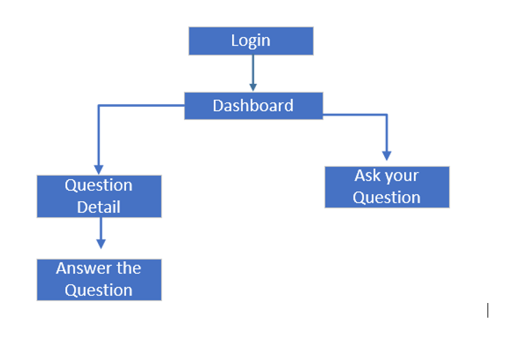
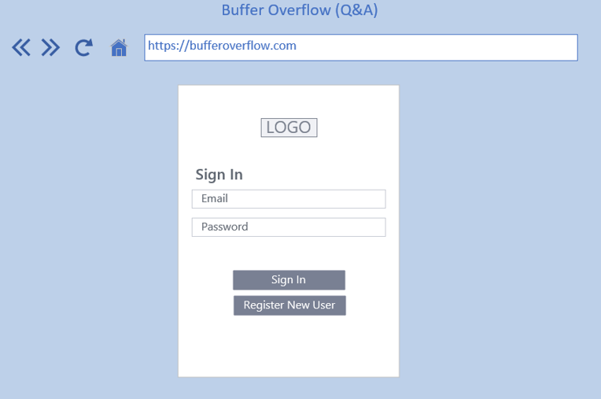
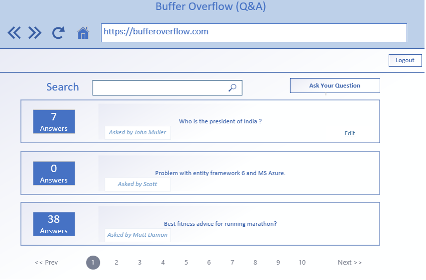
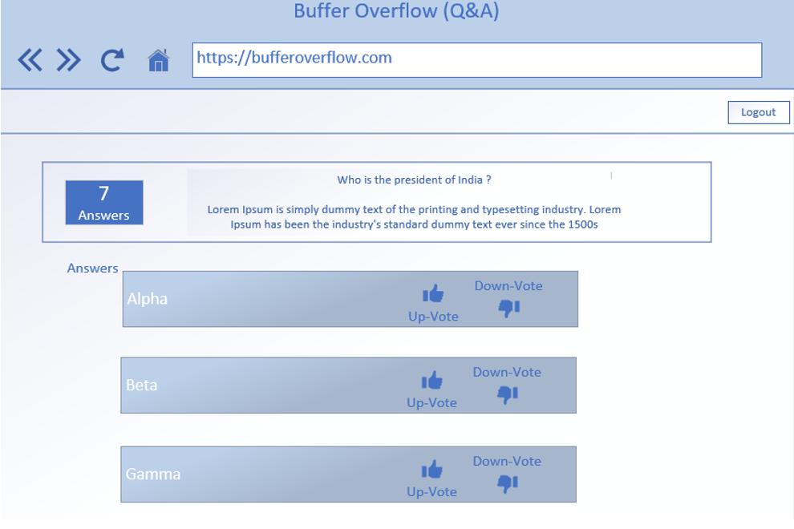
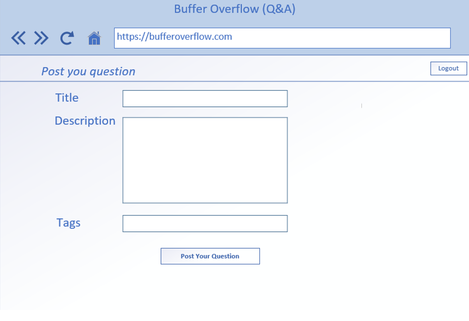

# BufferOverflow

This project was generated with [Angular CLI](https://github.com/angular/angular-cli) version 8.0.6.

## Development server

Run `ng serve` for a dev server. Navigate to `http://localhost:4200/`. The app will automatically reload if you change any of the source files.

## Code scaffolding

Run `ng generate component component-name` to generate a new component. You can also use `ng generate directive|pipe|service|class|guard|interface|enum|module`.

## Build

Run `ng build` to build the project. The build artifacts will be stored in the `dist/` directory. Use the `--prod` flag for a production build.

## Running unit tests

Run `ng test` to execute the unit tests via [Karma](https://karma-runner.github.io).

## Running end-to-end tests

Run `ng e2e` to execute the end-to-end tests via [Protractor](http://www.protractortest.org/).

## Further help

To get more help on the Angular CLI use `ng help` or go check out the [Angular CLI README](https://github.com/angular/angular-cli/blob/master/README.md).

## Requirements

The application being created should fulfill the following requirements.
1.	Login and Sign-Up functionality
a.	Login should work on providing registered email and password.
b.	Register new user should ask for:
i.	Email
ii.	Password
iii.	First and Last Name (Alphabets and spaces only)
iv.	Profile Image (JPG or PNG)
c.	All fields are mandatory.
d.	E-Mail must be unique and valid as per standard format.
e.	Password minimum length is 8 and it must have at-least 1 special character, 1 number and 1 alphabet each.
f.	After login user lands on dashboard page (details below)

2.	Dashboard
a.	This page lists most recent questions asked. They are listed in reverse chronological order. i.e. Latest question comes on top.
b.	Pagination should work with 10 questions per page.
c.	Anonymous (Non-logged in) user should be allowed on this page.

3.	Search Question: 
a.	User can type any text and click search button.
b.	The dashboard should be refreshed with search results.
c.	Questions in Search results should show
i.	Title of question.
ii.	Number of times answered.
iii.	Asked by “username”.
iv.	Edit link (Only visible to the person who raised the question)
d.	Anonymous (Non-logged in) user should be allowed to search.

4.	Question Detail
a.	Clicking on any question should open the detail page with all answers listed below.
b.	The answers should be in the order of Votes i.e. Most up-voted answer on the top.
If two answers have same votes, then most recent one should be on top.
c.	Corresponding to every answer, there should be a up-vote and down-vote button.
i.	Only logged in user can Upvote/Downvote any answer
ii.	One user is entitled to only ONE vote. (either up or down)
iii.	Net count of votes (up - down) should be shown with each answer. This count should update dynamically.

5.	Answer the Question: Provide ability to user for answering the question on this page.
a.	Only logged in user can answer the question.
b.	Allow ability to edit/delete the answer. (only to his/her own answer)

6.	Ask Your Question
a.	This button should be visible to only logged in users.
b.	To post any question user should fill
i.	Title 
ii.	Description
iii.	Tags
c.	On clicking “Post your question”, the question gets saved and should be displayed on top of Dashboard.
d.	Edit should only be allowed to user for his/her own question. (mockup in second point)

## Technical Implementation

Created an end to end functional application using n-tier architecture to achieve the business story discussed above. To aid your thinking process and to set expectations in terms of output required find listed below the various components that go into making such an application

1.	SQL database									
a.	Should contain tables (if you want procedures – not mandatory) required for the business case  			
i.	Consider good design – Normalization, Constraints etc.
ii.	Map complete information

2.	Data Access Layer 								
a.	Should contain classes to help interact with the database.
b.	Use Entity Framework for database interaction.
c.	Feel free to use procedures (if you created them above) or use entities alone to complete DAC operations.

3.	Business Layer								 
a.	Should contain classes to represent the business logic to cover all the requirements mentioned in Requirements section.

NOTE: Any common code – DTOs, constants etc., which can be used by any other layer can be made part of Shared Layer (optional).

4.	Presentation Layer: Highlight use of Asp.Net MVC 6 And/Or .NET WebAPI.

5.	UI presentation layer using Angular 2, HTML, CSS, JS.
a.	This should take care of UI validations.
b.	Make RESTful calls to MVC controller for data.
The following diagram shows a high-level structure and data flow for the application.

## Technology Stack
•	UI Layer – HTML5, JS, CSS3, Angular 2
•	Presentation Layer– Asp.Net MVC 6, Asp.Net WebAPI
•	Business and Data Layer – .NET, Entity Framework, SQL Server

